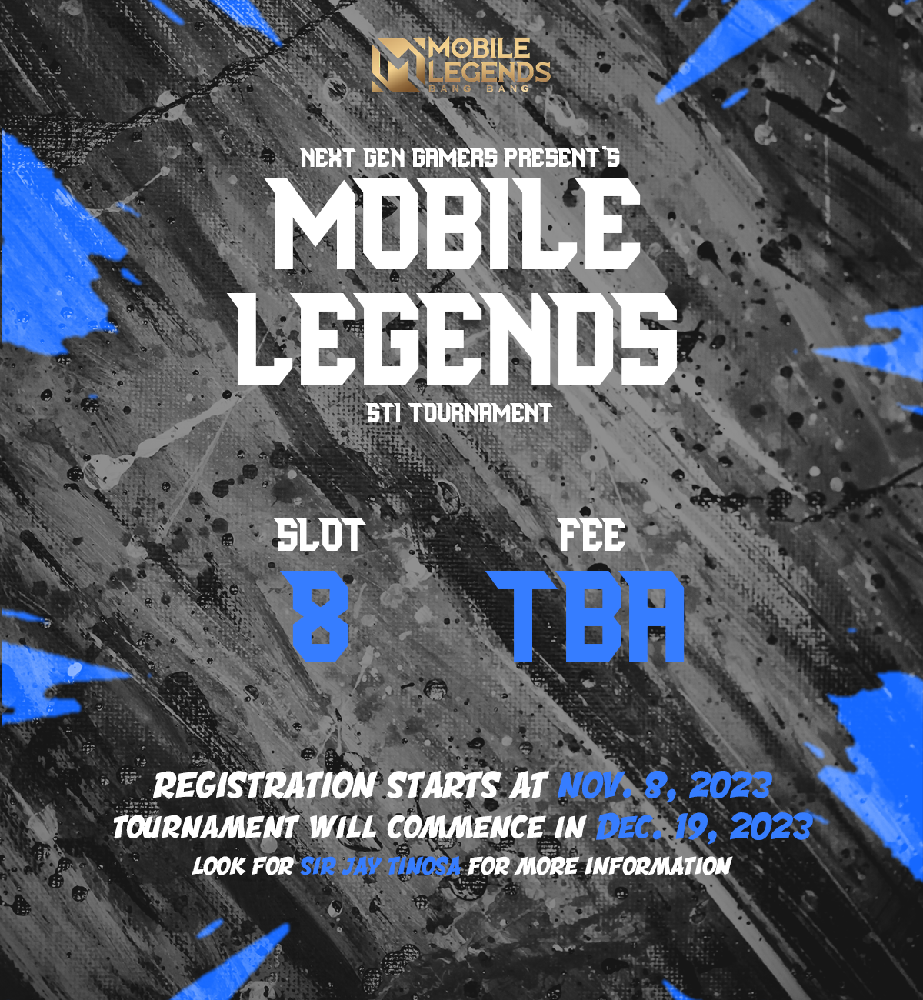
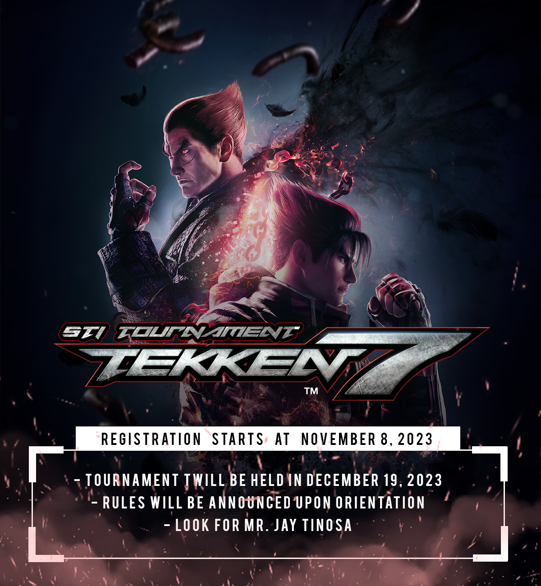

## Campus Week Gaming Tournament
### December 19, 2023

#### Games
- Tekken
- Mobile Legends

#### Tekken
- Registration Date: November 8, 2023
- Registration Fee: 50 PHP
- Players: 16
- Tournament Format: Single Elimination
- Winning Condition (Prelims & Semis): Best of 1
- Winning Condition (Finals): Best of 5
- Total number of games: 17
- Prize: Zeus x Gundam Wired Gaming Mouse
- Assigned Members: David, Mark, Ix & Jeff
- Room Assignment: 205

#### Mobile Legends
- Registration Date: November 8, 2023
- Team Registration Fee: 250 PHP
- Teams: 8
- Tournament Format: Single Elimination
- Winning Condition (Prelims): Best of 1
- Winning Conditoion (Semis): Best of 3
- Winning Condition (Finals): Best of 5
- Total number of games: 15
- Prize: Tuneful N35 TWS Bluetooth Wireless Earphone 5.2
- Assigned Members: Dianne, Joanna, Kristine & Rose
- Shoutcaster: ???
- Room Assignment: 204 & 206

#### Tasks
- Post the tournament information.
- Manage the registrations.
- Create tournament rules & regulations.
- List & procure necessary equipments.
- Purchase the prizes.
- Recruit important personnel.???

#### Posters

